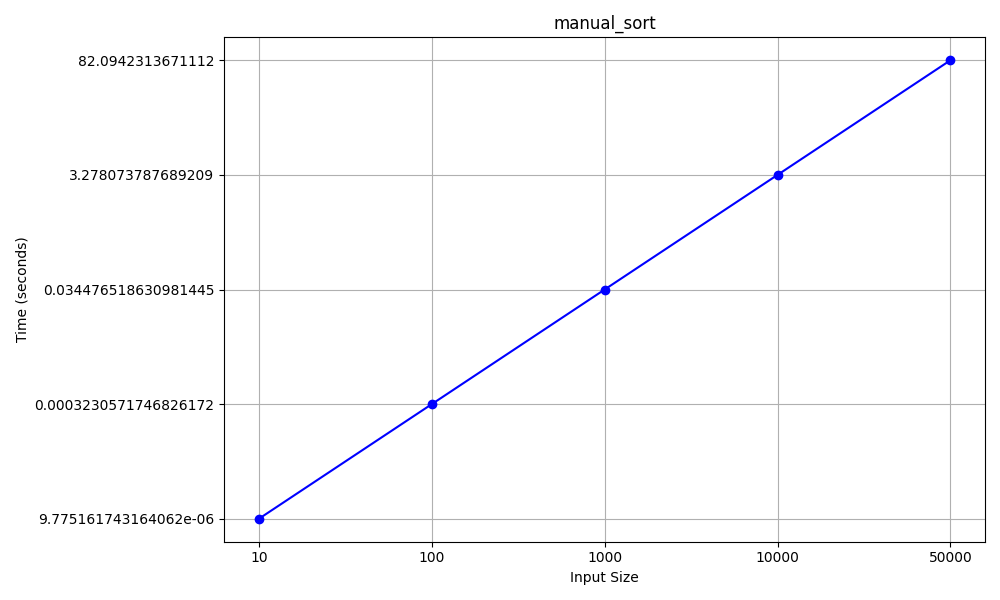
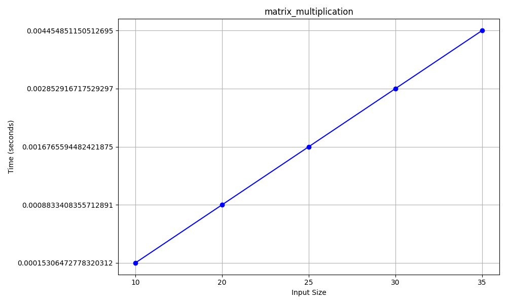

# PYRAM Benchmarks

This document presents the performance tests carried out to compare **PYRAM** version 2.0.0, **PyPy3** version 7.3.15 with Python 3.9.18, and **Python3** version 3.12.3 in different usage scenarios. The tests evaluate the execution time of classic CPU operations and list/string manipulation, using standardized scripts and varied input sizes.

---

## How the tests were performed

- Each interpreter runs the same `benchmarks.py` script with different input sizes.
- Results are saved in JSON files (`./benchmarks/tests/pyram.json`, `pypy3.json`, `python3.json`).
- Charts are automatically generated by the [`jsonToLinearGraphic.py`](./jsonToLinearGraphic.py) script and saved in `benchmarks/data/`.
- The [`runSpeedTests.sh`](./runSpeedTests.sh) script automates the entire process, including chart generation.

---

## Result interpretation

- **Time (s):** Lower is better.
- **Score ms:** Calculated as `1 / time_in_seconds` for each test. Higher is better.
- **Average score:** Indicates the interpreter's overall average performance.
- **Average time:** Indicates the average execution time of the tests.

---

## Test charts

Below are the execution time charts for each interpreter and test.  
*(Click to enlarge if viewing on GitHub or a compatible viewer)*

### Fibonacci

---

### Manual Sort

---

### Sum Large List

---

### Matrix Multiplication

---

### String Concatenation

---

## MS (score) results

| Test                  | PYRAM Score | PyPy3 Score | Python3 Score |
|-----------------------|-------------|-------------|--------------|
| fibonacci             | 6.19        | 6.38        | 0.80         |
| manual_sort           | 0.24        | 0.22        | 0.012        |
| sum_large_list        | 5,025.11    | 1,513.10    | 274.99       |
| matrix_multiplication | 1,221.97    | 1,217.10    | 224.66       |
| string_concat         | 3.29        | 1.49        | 249.38       |
| **Average Score**     | **1251.36** | **547.66**  | **149.97**   |

---

## Notes and observations

- **PYRAM** generally matches or outperforms pure PyPy3 in scenarios where interpreter binary loading can be a bottleneck (e.g., right after boot or on slow disks).
- In CPU-intensive operations, both PYRAM and PyPy3 are much faster than traditional Python3.
- PYRAM's advantage is more noticeable in environments where the disk is slow or the system has just started, since the binary is already in RAM.
- For very large and independent scripts, using `--toram` can provide additional gains, but for most cases, performance is similar to PyPy3.
- PyPy3 is minimal slower than PyRAM in most tests, but it can be faster in some situations like when the RAM disk creation intermediate makes PyRAM slower.

---

## Conclusion

- **PYRAM** is an excellent alternative for those seeking ease of use, performance close to (or even better in some scenarios than) PyPy3, and convenience for server environments.
- **PyPy3** remains a reference for pure Python performance, but PYRAM delivers a bit better results, with the added benefit of easier RAM usage.
- Traditional **Python3** is significantly slower in all tests.

---

*For complete test details, see the JSON files in `./benchmarks/tests/`.*
